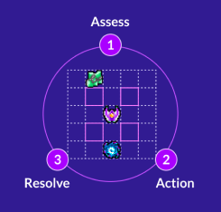

# Wasm Space Program

> **Note** <br>
> [Read the blog post here!](https://www.singlestore.com/blog/revolution-2022-wasm-space-program/)

In this demo we simulate a fake universe full of thousands of solar systems. In each solar system there are many space ships and energy nodes. Each space ship is controlled by an AI written in Rust and deployed into SingleStore as a user defined function (UDF) using our new [Code Engine (Powered by Wasm)][code-engine]. The AI is able to observe a 16x16 region of cells around it in order to decide what to do. We execute one turn every second which involves running a series of update queries against SingleStore. These update queries implement asking every AI for their next action and then resolving all actions.

The key technologies used are:
* every solar system is sharded to a specific partition which allows this demo to horizontally scale
* wasm is used to embed complex agent behavior into the engine and run it in parallel over all of the entities
* the game client is written in javascript and runs in the browser - so we use the data api to run queries directly against singlestore to gather and display game state
* the demo is designed to work perfectly with multiple workspaces in order to support many game clients all observing the simulation concurrently

## Turn Resolution

<p align="center">
  
</p>

1. All ships can see entities up to 8 cells away.
2. Each ship decides what to do from the following options:
    - **Hold (energy: 1):** The ship stays where it is.
    - **Move (energy: 2):** The ship moves up to its speed in a
      cardinal direction.
    - **Upgrade (energy: 50):** The ship upgrades its Blasters, Harvesters, or Thrusters.
3. All actions are resolved at the same time in a single database
    transaction and the game rules are applied.

### Detailed rules

- Ships at the same location will fight. Damage is calculated based on
  the number of blasters each ship has.
- Ships alone in a call with energy nodes will consume some amount of
  energy based on the number of harvesters the ship has.
- A ship may only move up to N cells per turn where N is the number of
  thrusters the ship has.
- Each ship has a shield which recharges 1% per turn if the ship is not
  in combat.
- Any ship which looses all of its shield explodes, leaving behind all
  of its energy at the ships location.
- Any ship which runs out of energy explodes leaving nothing behind.

## Architecture

This game runs entirely within [SingleStore][s2] and the browser.
SingleStore, a scale out relational database optimized for transactions
and analytics, stores the game state and handles turn resolution. The
game client runs in the browser and communicates directly with
SingleStore over our [Data API][data-api].

<p align="center">
  
</p>

# Running the demo locally

1. spin up SingleStore [on the managed service][try-free]
2. copy backend/config.example.toml to backend/config.toml and update
    * database.host/database.port should point at a mysql protocol endpoint
    * web.endpoints should be an array of urls to the data api port of your SingleStore cluster - the web frontend will load balance over these endpoints (i.e. you can provide readonly workspace endpoints here)
3. compile the agent:
   ```bash
   cd agent
   cargo wasi build --release
   ```
4. run schema.sql on your singlestore cluster
5. run the backend:
   ```bash
   cd backend
   go build -o backend
   ./backend --config config.toml
   ```
6. run the frontend
   ```bash
   cd web
   yarn
   yarn dev
7. open your browser to http://localhost:3000
8. generate some solar systems
    ```sql
    -- run this once
    insert into solar_system (x, y) values (floor(rand(now()) * 500), floor(rand(now() + 1) * 500));

    -- then run this a couple times, each time will double the number of solar systems. I don't recommend running more than 1000 solar systems on a single machine.
    insert into solar_system (x, y) select floor(rand(now() + sid) * 500) x, floor(rand(now() + sid + 1) * 500) y from solar_system;
    ```

**Have fun!**

[s2]: https://www.singlestore.com
[data-api]: https://docs.singlestore.com/managed-service/en/reference/data-api.html
[try-free]: https://www.singlestore.com/cloud-trial/
[code-engine]: https://docs.singlestore.com/managed-service/en/reference/code-engine---powered-by-wasm.html
