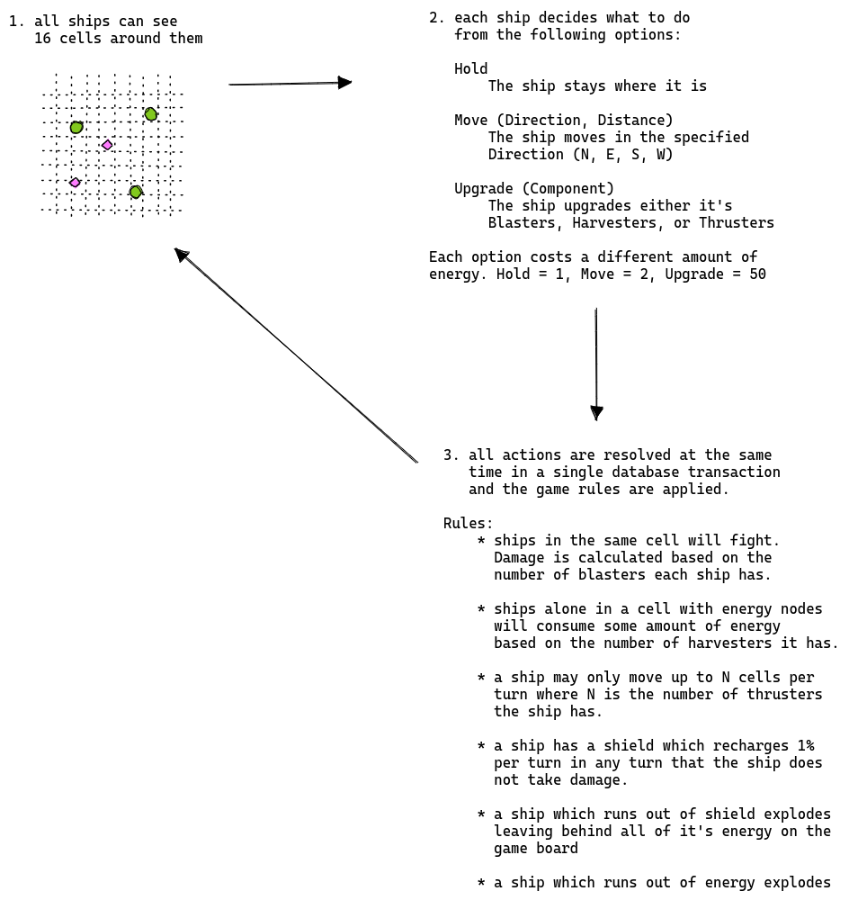
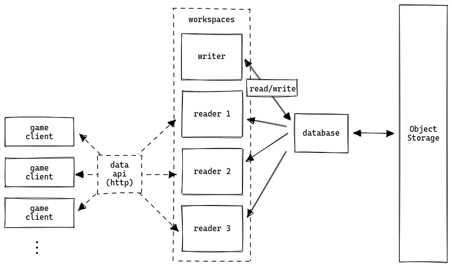

# Wasm Space Program

In this demo we simulate a fake universe full of thousands of solar systems. In each solar system there are many space ships and energy nodes. Each space ship is controlled by an AI written in Rust and deployed into SingleStore as a UDF using our new Code Engine (Wasm). The AI is able to observe a 16x16 region of cells around it in order to decide what to do. We execute one turn every second which involves running a series of update queries against SingleStore. These update queries implement asking every AI for their next action and then resolving all actions.

The key technologies used are:
* every solar system is sharded to a specific partition which allows this demo to horizontally scale
* wasm is used to embed complex agent behavior into the engine and run it in parallel over all of the entities
* the game client is written in javascript and runs in the browser - so we use the data api to run queries directly against singlestore to gather and display game state
* the demo is designed to work perfectly alongside workspaces in order to better scale out to many game clients all observing the simulation concurrently

## Turn Resolution


## Architecture


# Running the demo locally

1. run singlestore in a docker container (make sure it has data api and wasm enabled) or maybe somewhere else if you are adventurous
2. update backend/config.example.toml to point at your container
   * database.host/database.port should point at the mysql endpoint of your singlestore cluster (one of the aggs)
   * web.endpoints should be an array of urls to the data api port of your SingleStore cluster - the web frontend will load balance over these endpoints (i.e. you can provide workspace endpoints here)
3. compile the agent:
   ```bash
   cd agent
   cargo wasi build
   ```
4. run schema.sql on your singlestore cluster
5. run the backend:
   ```bash
   cd backend
   go build -o backend
   ./backend --config config.example.toml
   ```
6. run the frontend
   ```bash
   cd web
   yarn
   yarn dev
7. open your browser to http://localhost:3000#sid=0
8. create some entities with sid=0 (sid is the id of the solar system) (see schema.sql for examples)

Notice that the url contains useful things like the sid to look at. This will get fancier once I build the universe map, but till then you can look at solar systems by changing `sid=X` in the url.

You can also add `debug=true` to see the grid and `play=true` for a simple sprite playground.

Have fun!

## game world

The game is set in space and composed of many independent solar systems.

Each solarsystem is periodically seeded with a random number of asteroids of differing sizes. The asteroids move slowly in a fixed pattern around the system.

Each solar system has a fixed number of warp-gates to adjacent solar systems. Warp-gates are invincible.

## ships

Each "player" whether human or AI is a single ship spawned randomly in the universe. A ship starts with a small amount of initial resources and one of each component.

Ships have the following properties:

* shield
  * a ship explodes upon reaching 0 shield
  * starts with 100 shield which is also the maximum
  * shield is damaged by the blasters on other ships
  * shield recovers 1 shield every turn
* blasters
  * a ship starts with one blaster
  * a ship can't have more than 10 blasters
  * a ship can use it's blasters to attack other ships
* thrusters
  * a ship starts with one thruster
  * a ship can't have more than 10 thrusters
  * a ship can move up to as many cells as it has thrusters in a straight line per turn
* harvesters
  * a ship starts with one harvester
  * a ship can't have more than 10 harvesters
  * a ship can use it's harvesters to absorb energy from energy nodes
* energy
  * a ship starts with 100 energy
  * a ship gains energy by harvesting energy nodes
  * a ship spends energy to take actions, each action consumes a different amount of energy.

Ships can buy additional blasters, thrusters, and harvesters using energy.

## objective

The objective of the game is to survive as long as possible.

## actions

Actions are encoded into a single byte:

The 3 high bits encode the action
The 5 low bits encode the argument

000 00000

* hold
  * costs 1 energy
  * high: 000
  * low: 00000
* move
  * costs 5 energy
  * high: 001-100 (north, east, south, west)
  * low: distance
* upgrade
  * costs 50 energy
  * bits: 101
  * low
    * 00000: blaster
    * 00001: thruster
    * 00010: harvester

## turn order

1. every entity chooses a single action to take
   * entity's can only see the position and kind of every other object in the current solar system and less than 8 cells away
2. 